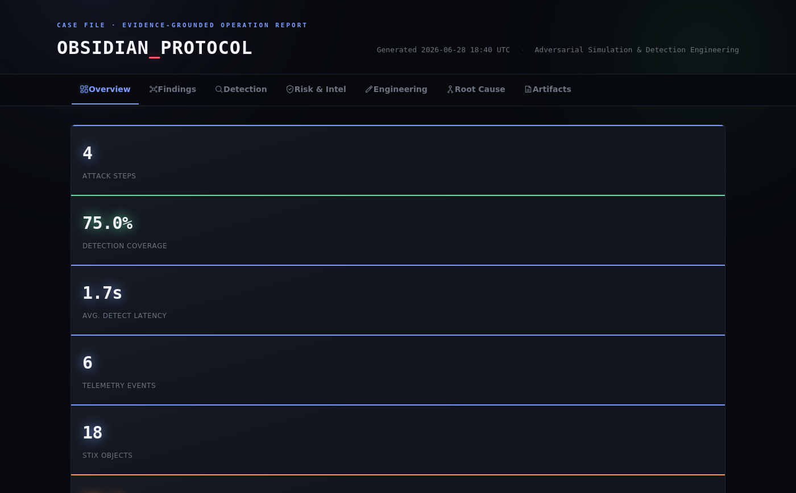
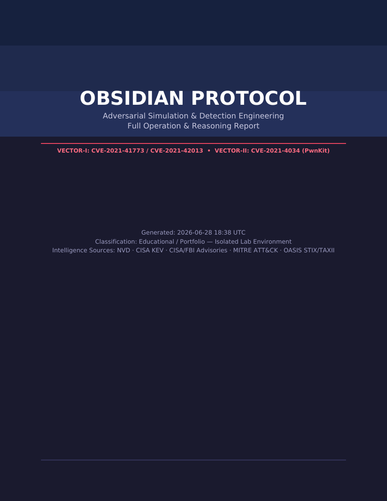
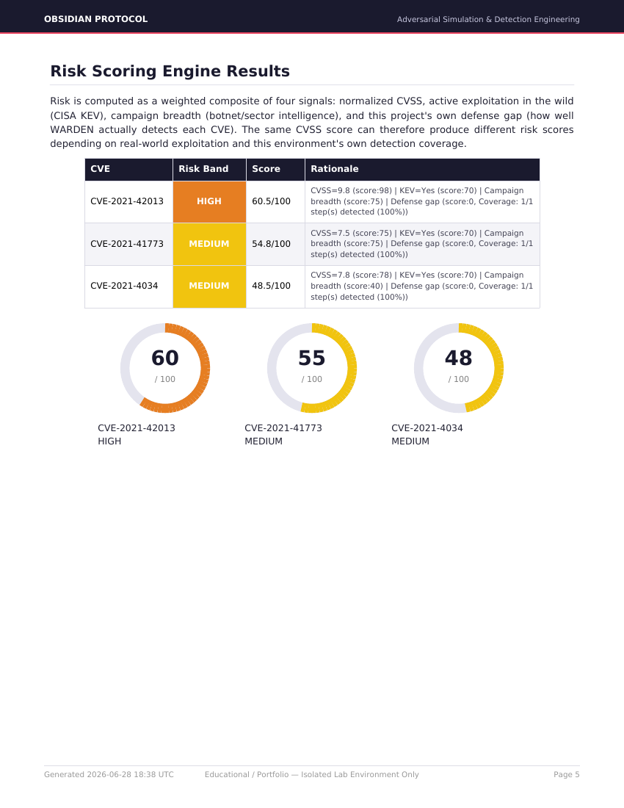

<p align="center">
  
</p>

<h1 align="center">OBSIDIAN PROTOCOL</h1>
<p align="center"><strong>Evidence-Driven Security Reasoning Platform</strong></p>
<p align="center">by <a href="https://github.com/adrianjamesblackwell">Adrian James Blackwell</a> · <a href="https://github.com/adrianjamesblackwell">github.com/adrianjamesblackwell</a></p>

<p align="center">
  
  
  
  
</p>
<p align="center">
  
  
  
  
  
</p>

> **Classification:** Educational / Portfolio. All operations were
> conducted in an isolated lab environment with no internet access. No
> third-party or live systems were accessed in any way. All
> intelligence sources used (NVD, CISA KEV, CISA/FBI advisories, MITRE
> ATT&CK, OASIS STIX/TAXII) are entirely public standards.

---

## Dashboard Preview

The platform ships its own self-contained, interactive HTML dashboard
(`reports/obsidian_protocol_report.html`) — no server, no external
dependency, just one file. The **Overview** tab below renders live
from the actual pipeline run shown throughout this README:

<p align="center">
  
</p>

The dashboard has seven tabs (Overview, Findings, Detection, Risk &
Intel, Engineering, Root Cause, Artifacts) and includes a fully
interactive, draggable, zoomable render of the actual Blackwell
Evidence Graph — every chart is wired to the same underlying JSON, not
a static image. See [`examples/sample_report.html`](examples/sample_report.html)
to open the full dashboard yourself without running anything.

The same pipeline also produces a print-ready, multi-page PDF
operation report (`reports/obsidian_protocol_report.pdf`):

<p align="center">
  
  
</p>

---

## What problem does this project solve?

OBSIDIAN PROTOCOL is not a lab limited to exploiting a single CVE
chain — it's a platform that uses the data that chain produces to
simulate the operational problems SOC teams actually live with every
day. The platform's output is deliberately not a log line, a Sigma
match, or an IOC. It is an **evidence-grounded security
recommendation** — a conclusion with its supporting reasoning attached
and traceable, produced by the **Blackwell Core** reasoning layer
described below, sitting on top of 17 modules that each correspond to
a named, documented industry problem:

| Real-world problem | OBSIDIAN module | Question it answers |
|---|---|---|
| Alert fatigue (20K–200K+ alerts/day, 90%+ FP) | **CORRELATION ENGINE / BCA** | Are these 6 alerts actually one operation? |
| "We don't know what we can actually catch" | **COVERAGE HEATMAP** | Which MITRE tactics do we have real visibility into? |
| Writing a Sigma rule is easy; writing a *good* one is hard | **RULE QUALITY** | What's this rule's FP risk, performance cost, coverage? |
| IOCs lose value fast | **IOC DECAY** | Can we still trust this IOC? |
| "Which log source are we missing?" | **TELEMETRY GAP** | Which MITRE tactic is a blind spot for us? |
| Red team quality is hard to measure | **EMULATION SCORE** | Is this emulation realistic, or just easy? |
| "How did the attack progress?" (a table only) | **RISK GRAPH** | What's the real path from Internet to Database? |
| An IOC was found but nobody knows why it happened | **ROOT CAUSE** | What was the root cause, and how do we prevent it? |
| Post-incident, "what happened when" is unclear | **ATTACK REPLAY** | How did the attack unfold, minute by minute? |
| The CEO doesn't read Sigma rules | **EXECUTIVE REPORT / DECISION ENGINE** | Risk level, impact, action — on one page |
| Conclusions aren't traceable to their evidence | **BLACKWELL EVIDENCE GRAPH** | Why does the system believe this? |
| Confidence is a single brittle bucket | **BLACKWELL CONFIDENCE ENGINE** | How much corroboration actually backs this? |
| Severity and urgency get conflated | **BLACKWELL EVIDENCE RANKING** | What should an analyst look at first? |

---

## Blackwell Core: the reasoning layer

[`blackwell-core/`](blackwell-core/) is a research-grade reasoning
layer that sits **on top of** the 17-module pipeline below — it does
not replace or fork any of it. Every legacy module keeps working
completely standalone. Blackwell Core's job is to turn the existing
modules' outputs into a single, queryable, auditable evidence
structure, and to produce decisions instead of dashboards.

| # | Component | What it does |
|---|---|---|
| 1 | **Blackwell Evidence Graph (BEG)** | The substrate. A typed graph of claims (not entities) and the evidence relationships between them — `SUPPORTS`, `CONTRADICTS`, `CAUSES`, etc. |
| 2 | **Blackwell Correlation Algorithm (BCA) v1.0** | Formally specified, graph-native successor to `correlation-engine/correlate.py` |
| 3 | **Blackwell Risk Score (BRS) v1.0** | Formalized, graph-integrated version of `risk-engine`'s composite risk formula |
| 4 | **Blackwell Confidence Engine (BCE)** | Continuous, multi-signal confidence — corroboration, source diversity, pattern strength, contradiction penalty |
| 5 | **Blackwell Knowledge Graph (BKG)** | Entity-relationship view, derived as a pure projection of BEG — never a second source of truth |
| 6 | **Blackwell Temporal Reasoning (BTR)** | Tempo classification and anomalous-gap detection within an incident's timeline |
| 7 | **Blackwell Evidence Ranking (BER)** | "What should an analyst look at first" — a different question from confidence, with the confidence term deliberately inverted |
| 8 | **Blackwell Attack Path Prediction (BAPP)** | Structural next-step hypotheses from documented ATT&CK tactic transitions — explicitly **not** adversary forecasting |
| 9 | **Blackwell Decision Engine (BDE)** | Joins every module above into one prioritized action list, with a technical briefing and an executive briefing generated from the same underlying decision object |

See [`blackwell-core/README.md`](blackwell-core/README.md) for the
full architecture, the run order, and
[`blackwell-core/benchmark/README.md`](blackwell-core/benchmark/README.md)
for what was actually measured — and what was deliberately **not**
claimed.

The full research write-up is in
[`docs/whitepaper/`](docs/whitepaper/).

---

## Operation summary

A real CVE chain from the CISA KEV catalog (Apache RCE → PwnKit local
privilege escalation) was reproduced in an isolated environment, with
the **entire lifecycle** of that operation — attack, telemetry,
correlation, detection validation, risk scoring, root cause analysis,
intelligence sharing, and executive reporting — automated across a
17-module platform.

| # | Module | Function |
|---|---|---|
| 1 | **VECTOR-I / VECTOR-II** | Attack chain — exploitation infrastructure and execution |
| 2 | **TELEMETRY** | Hybrid data collection (auditd + eBPF + Apache log) and timeline construction |
| 3 | **CORRELATION ENGINE** | Groups raw events into incidents, reducing alert volume |
| 4 | **PURPLE TEAM** | Attack -> detection -> validation automation, Detection Coverage |
| 5 | **RISK ENGINE** | Composite risk scoring (CVSS + KEV + campaign + defense gap) |
| 6 | **COVERAGE HEATMAP** | Visual MITRE-tactic-based coverage map |
| 7 | **TELEMETRY GAP** | Prioritizes missing log sources by MITRE impact |
| 8 | **RULE QUALITY** | FP/performance/coverage analysis of Sigma rules |
| 9 | **IOC DECAY** | Confidence scoring for IOCs by age/frequency/source count |
| 10 | **ROOT CAUSE** | Causal chain from CVE to root cause (patch policy, config, WAF) |
| 11 | **EMULATION SCORE** | Diversity/realism/noise score for the red team operation |
| 12 | **RISK GRAPH** | Internet->Database attack path visualization (Mermaid) |
| 13 | **ATTACK REPLAY** | Minute-by-minute, evidence-timestamped replay of the attack |
| 14 | **SIGINT** | Threat Intelligence — campaign analysis using NVD/KEV/CISA data |
| 15 | **WARDEN** | Detection Engineering — Sigma/YARA rules, MITRE mapping |
| 16 | **INTEL EXPORT** | STIX 2.1 + TAXII 2.1 compliant IOC export |
| 17 | **REPORTING** | ATT&CK Navigator, HTML/PDF report, Executive Summary |

---

## Interview briefing (3-4 sentences)

> I built OBSIDIAN PROTOCOL by exploiting a real CVE chain from the
> CISA KEV catalog, end to end from recon to root, in my own isolated
> Docker environment, then used the data that operation produced to
> build a 17-module platform solving SOC teams' real operational
> problems (alert fatigue, detection coverage blindness, IOC aging,
> telemetry gaps). On top of that I built Blackwell Core, a reasoning
> layer with its own named algorithms (BCA correlation, BRS risk
> scoring, a Confidence Engine, an Evidence Ranking algorithm) that
> turns every module's output into a single auditable Evidence Graph
> and a Decision Engine producing both a technical and an executive
> briefing from the same underlying evidence. My Correlation Engine
> reduces 6 raw alerts to one high-confidence incident; my Risk Graph
> visually distinguishes the real/hypothetical attack path from
> Internet to Database; my Root Cause module answers "why did this CVE
> happen" at the patch-policy/WAF/segmentation level. Every number any
> module produces comes from its own real output — nothing is
> fabricated, and limitations are written explicitly in
> `docs/research-findings.md` and in every module's own docstring.

---

## System architecture

Detailed diagram: [`docs/architecture.mermaid`](docs/architecture.mermaid)

```
OPERATOR --VECTOR-I/II--> TARGET-49 --> root
                |
                v
         TELEMETRY (hybrid: auditd+eBPF+Apache)
                |
                v
      CORRELATION ENGINE (alert reduction)
                |
   +------------+------------+--------------+-------------+
   v            v            v              v             v
PURPLE TEAM  SIGINT       WARDEN      TELEMETRY GAP   RULE QUALITY
(coverage)  (campaign)   (Sigma/YARA)  (log gaps)     (rule quality)
   |            |            |              |             |
   +------------+------------+--------------+-------------+
                |
                v
          RISK ENGINE (composite score)
                |
   +------------+------------+--------------+-------------+
   v            v            v              v             v
ROOT CAUSE  RISK GRAPH   IOC DECAY    EMULATION SCORE  ATTACK REPLAY
                |
                v
   INTEL EXPORT (STIX/TAXII) + ATT&CK NAVIGATOR
                |
                v
   REPORTING (HTML + PDF + Executive Summary)
                |
                v
   ============================================
        BLACKWELL CORE (reasoning layer)
   ============================================
   EVIDENCE GRAPH <- ingests all module outputs
        |
        v
   BCA -> BRS -> CONFIDENCE ENGINE -> KNOWLEDGE GRAPH
        |
        v
   TEMPORAL REASONING -> EVIDENCE RANKING -> ATTACK PATH PREDICTION
        |
        v
   DECISION ENGINE -> technical briefing + executive briefing
```

## Attack vectors

| Vector | CVE | Component | Type | CVSS | KEV status |
|---|---|---|---|---|---|
| **VECTOR-I** | CVE-2021-41773 / CVE-2021-42013 | Apache HTTPD 2.4.49 | Path Traversal → RCE | 9.8 | ✅ Actively scanned by the AndroxGh0st botnet |
| **VECTOR-II** | CVE-2021-4034 ("PwnKit") | polkit/pkexec | Local Privilege Escalation | 7.8 | ✅ Went unnoticed for 13 years, added to KEV in 2022 |

Full operation narrative: [`docs/walkthrough.md`](docs/walkthrough.md)
Measurable metrics, limitations, future work: [`docs/research-findings.md`](docs/research-findings.md)

## Deployment (one command)

```bash
git clone <this-repo>
cd obsidian-protocol
./setup.sh
```

## End-to-end run

```bash
# 1. Bring up the range
./setup.sh

# 2. Exploit VECTOR-I/II following docs/walkthrough.md
#    (note the time of each step -> purple-team/attack_log_template.json)

# 3. Collect telemetry
python3 telemetry/build_timeline.py --live

# 4. Alert correlation (the Alert Fatigue solution)
python3 correlation-engine/correlate.py

# 5. Purple Team validation
python3 purple-team/validate.py purple-team/attack_log_template.json

# 6. Threat intelligence
python3 threat-intel/fetch_cve_intel.py CVE-2021-41773 CVE-2021-42013 CVE-2021-4034

# 7. STIX/TAXII export
python3 intel-export/stix_export.py

# 8. Generate every analysis engine + report in one command
python3 reporting/generate_all_reports.py

# 9. Run the Blackwell Core reasoning layer on top of all of the above
python3 blackwell-core/evidence-graph/evidence_graph.py
python3 blackwell-core/correlation-bca/bca.py
python3 blackwell-core/risk-score-brs/brs.py
python3 blackwell-core/confidence-engine/confidence_engine.py
python3 blackwell-core/knowledge-graph/knowledge_graph.py
python3 blackwell-core/temporal-reasoning/temporal_reasoning.py
python3 blackwell-core/evidence-ranking/evidence_ranking.py
python3 blackwell-core/attack-path-prediction/attack_path_prediction.py
python3 blackwell-core/decision-engine/decision_engine.py
```

`reporting/generate_all_reports.py` runs the Risk Engine, Coverage
Heatmap, Telemetry Gap, Rule Quality, IOC Decay, Root Cause, Emulation
Score, Risk Graph, Attack Replay, ATT&CK Navigator, Executive Report,
HTML, and PDF reports **all in sequence, with one command**.

Every module has its own `README.md`; see [`examples/`](examples/) for
sample output (you can see what the system produces without running
anything).

## Directory structure

```
obsidian-protocol/
├── setup.sh                       # One-command deployment + validation
├── docker-compose.yml              # Isolated range definition
├── docker/                          # TARGET-49 + OPERATOR images
├── telemetry/                        # Hybrid auditd+eBPF+Apache log collection
├── correlation-engine/                # Alert Fatigue: event -> incident grouping
├── purple-team/                        # Attack<->detection matching, Detection Coverage
├── risk-engine/                        # Composite risk scoring
├── coverage-heatmap/                   # MITRE tactic-based visual coverage
├── telemetry-gap/                       # Missing log source analysis
├── rule-quality/                        # Sigma rule quality analysis
├── ioc-decay/                            # IOC confidence/decay engine
├── root-cause/                           # CVE -> root cause chain
├── emulation-score/                       # Red team quality score
├── risk-graph/                             # Attack path graph (Mermaid)
├── attack-replay/                           # Timestamped attack replay
├── threat-intel/                             # SIGINT: NVD + CISA KEV + campaign data
├── detection/                                 # WARDEN: Sigma/YARA rules
├── intel-export/                               # STIX 2.1 + TAXII 2.1
├── reporting/                                   # Navigator + HTML/PDF + Executive Report
│   └── executive/                                # CEO-level summary
├── blackwell-core/                                # Evidence-driven reasoning layer (see above)
│   ├── evidence-graph/                             # BEG — the substrate
│   ├── correlation-bca/                            # BCA v1.0
│   ├── risk-score-brs/                             # BRS v1.0
│   ├── confidence-engine/                          # BCE
│   ├── knowledge-graph/                            # BKG
│   ├── temporal-reasoning/                         # BTR
│   ├── evidence-ranking/                           # BER
│   ├── attack-path-prediction/                     # BAPP
│   ├── decision-engine/                            # BDE — synthesis + dual-audience reports
│   └── benchmark/                                  # Validation framework
├── scripts/                                       # Exploit code written by the operator
├── reports/                                        # Generated report output
├── examples/                                        # Sample output (committed reference)
└── docs/
    ├── walkthrough.md                               # Operation log
    ├── threat-intelligence.md                        # SIGINT analysis
    ├── research-findings.md                           # Metrics, limitations, future work
    ├── analysis.md                                     # Operator assessment template
    ├── architecture.mermaid                            # System architecture
    ├── coverage-heatmap.md                              # Coverage Heatmap output (Markdown)
    ├── telemetry-gap-analysis.md                         # Telemetry Gap output (Markdown)
    ├── risk-graph.mermaid                                 # Risk Graph visual
    ├── detection-coverage-matrix.md                        # ATT&CK coverage table
    └── whitepaper/                                          # Full research write-up
```

## Module details

Every module has its own README with its formula/format explanation
and known limitations:

- [`telemetry/README.md`](telemetry/README.md) — hybrid architecture, why auditd+eBPF together
- [`correlation-engine/README.md`](correlation-engine/README.md) — alert reduction algorithm, confidence scoring
- [`purple-team/README.md`](purple-team/README.md) — matching algorithm, MTTD calculation
- [`risk-engine/README.md`](risk-engine/README.md) — composite risk formula, weighting logic
- [`coverage-heatmap/README.md`](coverage-heatmap/README.md) — MITRE tactic coverage methodology
- [`telemetry-gap/README.md`](telemetry-gap/README.md) — log source prioritization logic
- [`rule-quality/README.md`](rule-quality/README.md) — FP/performance/coverage scoring
- [`ioc-decay/README.md`](ioc-decay/README.md) — half-life-based decay model
- [`root-cause/README.md`](root-cause/README.md) — causal chain inference logic
- [`emulation-score/README.md`](emulation-score/README.md) — diversity/noise/coverage scoring
- [`risk-graph/README.md`](risk-graph/README.md) — real vs. hypothetical attack path distinction
- [`attack-replay/README.md`](attack-replay/README.md) — timestamped replay format
- [`detection/README.md`](detection/README.md) — auditd setup, MITRE mapping, patch table
- [`intel-export/README.md`](intel-export/README.md) — STIX object types, TAXII endpoints
- [`reporting/README.md`](reporting/README.md) — report chain, dependency order
- [`scripts/README.md`](scripts/README.md) — where your own exploit code goes
- [`docs/walkthrough.md`](docs/walkthrough.md) — the full guided operation log (recon to root)
- [`docs/threat-intelligence.md`](docs/threat-intelligence.md) — real campaign data (AndroxGh0st, PwnKit's 13-year timeline)
- [`docs/analysis.md`](docs/analysis.md) — operator assessment template (CVSS vs. real-world experience)
- [`docs/research-findings.md`](docs/research-findings.md) — metrics, limitations, future work, lessons learned
- [`blackwell-core/README.md`](blackwell-core/README.md) — the reasoning layer's full architecture

## Report Generation

| Command | Produces |
|---|---|
| `python3 reporting/generate_html_report.py` | Self-contained, interactive HTML dashboard with a live-rendered Evidence Graph |
| `python3 reporting/generate_pdf_report.py` | Print-ready, multi-page PDF report (cover page, table of contents, 14 sections including the full Blackwell Core breakdown) |
| `python3 reporting/executive/executive_report.py` | One-page, CEO-level executive summary (Markdown + JSON) |
| `python3 reporting/navigator/generate_navigator_layer.py` | ATT&CK Navigator layer + Markdown coverage matrix |
| `python3 reporting/generate_all_reports.py` | Runs the entire 23-step pipeline (every module above, in dependency order) end to end |

All four report formats are generated from the exact same
`reporting/collect_report_data.py` context object, so the PDF, the
HTML dashboard, and the executive summary can never silently disagree
with each other.

## Disclaimer

OBSIDIAN PROTOCOL is a platform that reproduces known, patched CVEs
for educational purposes, **deployed only in an isolated Docker
environment**. No scanning, exploitation, or unauthorized access
attempt was made against any real or third-party system. The
techniques shown here should only be used on systems you own or have
written authorization to test.

---

<p align="center">
  
</p>

<p align="center">
  <strong>Adrian James Blackwell</strong><br>
  <a href="https://github.com/adrianjamesblackwell">github.com/adrianjamesblackwell</a>
</p>

<p align="center"><sub>OBSIDIAN PROTOCOL is an independent research and portfolio project by Blackwell Intelligence.</sub></p>
